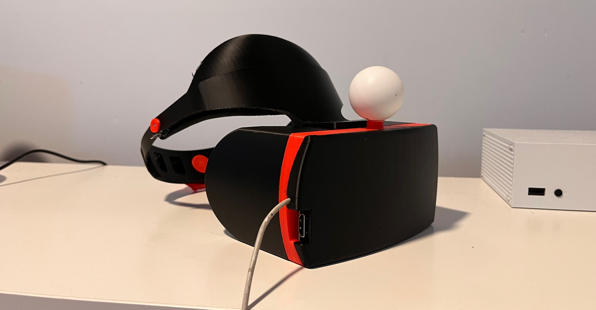
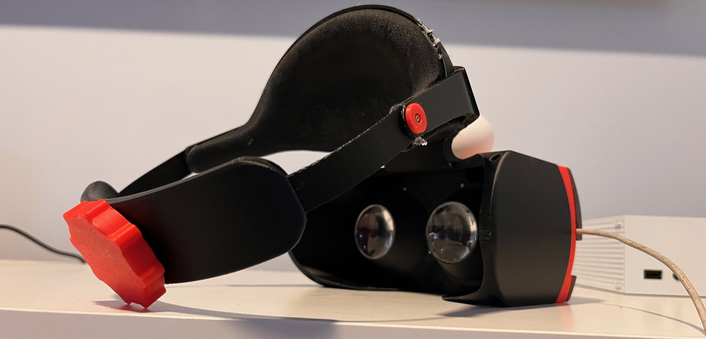
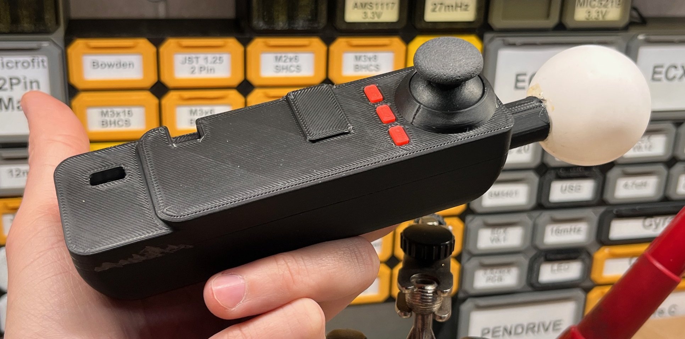

# vr-shell
您好！

我司目前已完成电子模块及结构外壳设计，现计划制作第一批样品（共计 30 套），特向贵司咨询相关打样与配件服务。

一、我方将提供以下资料：
外壳结构图（格式：STEP / STL / 2D图）

初版 BOM（Excel）

部分实物照片（可选）

二、样品制作需求说明：
打样数量：30 套（每套含：头显壳体 + 左右控制器壳体，共3件）

材料工艺：推荐 ABS / PC 注塑，如有建议请告知

表面处理：如可提供喷砂、喷漆、丝印等，请报价分项列出

三、配件与镜头模组需求：
螺丝 / 装配配件

是否可以由贵司提供组装所需螺丝/卡扣等标准配件？

若我方自行提供，是否能协助确认螺丝型号、材质与规格要求？

镜头模组

我们希望每套样品中预装/包含 VR 用镜头（双目放大镜片）；

请确认：

贵司是否可以提供合适镜头配件？是否可协助采购？

若无法提供，是否可推荐适配镜头型号及供应链？

装配与验证

是否支持打样完成后提供装配服务，并拍照或视频确认结构贴合情况？

四、报价请求
烦请提供此次打样的完整报价单，包括：

外壳结构件打样费用

螺丝及镜头模组费用（如支持）

表面处理及其他附加工艺

运费（如不包邮）

如贵司有标准流程、报价表或打样合同样本，也欢迎一并提供。

期待您的回复，感谢支持！

**头显外壳：**  
（请见下图）  

**操纵器:**
